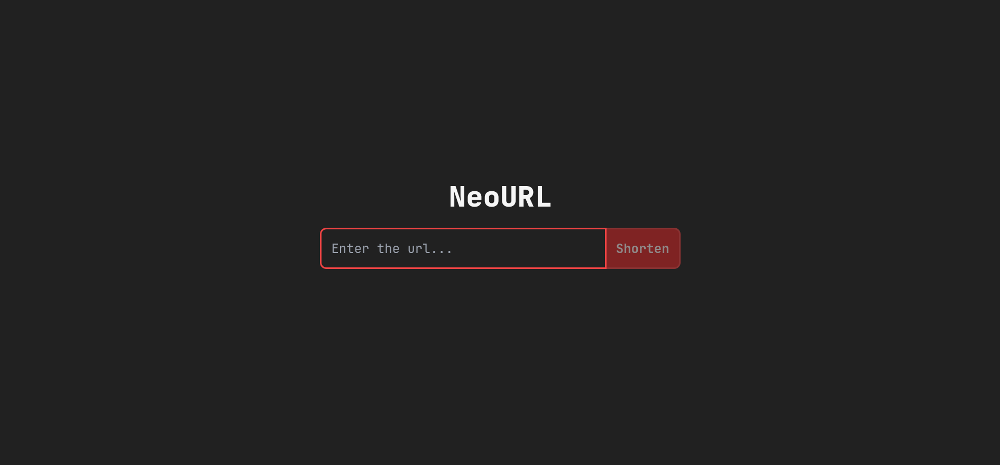
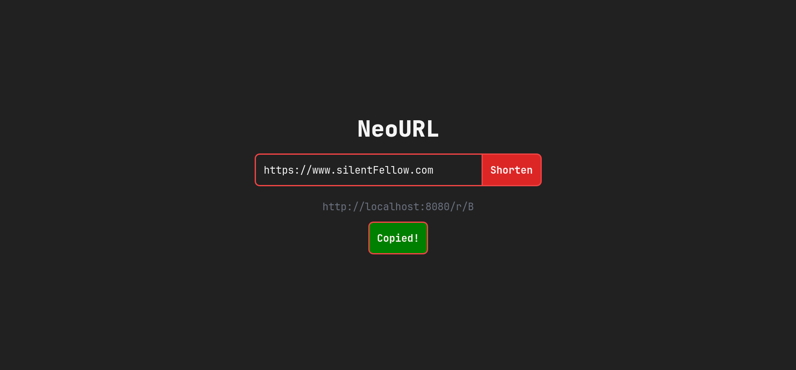
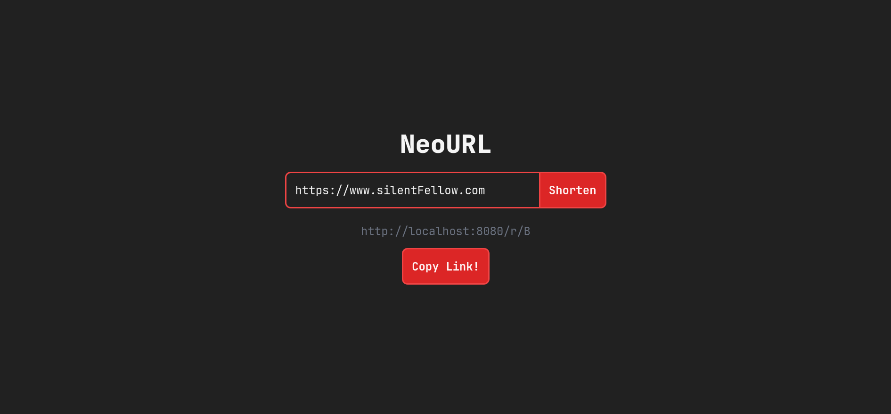

# Neourl

Neourl is a simple URL shortener application written in Golang with HTMX.

## Features

- Shorten long URLs
- Copy shortened URLs to clipboard
- Effective data encoding and decoding

## Screenshots

### Home Without URL



### Home With URL Copied



### Home With URL Non-Copied



### Not Found


## Installation

1. Clone the repository:
   ```sh
   git clone https://github.com/yourusername/neourl.git
   ```
2. Navigate to the project directory:
   ```sh
   cd neourl
   ```
3. Install dependencies:
   ```sh
   go mod tidy
   ```

## Environment Variables

- `SERVER_PORT` (optional): Set the port for the server to listen on. Default is `3000`.

You can also use a `.env` file to set environment variables. Create a `.env` file in the root directory of your project and add the following:

```
SERVER_PORT=8080
```

To run the application with the environment variables from the `.env` file:

```sh
go run cmd/main.go
```

- Open your browser and navigate to `http://localhost:{SERVER_PORT | 8080}` (or the port you set in the environment variables).

## Contributing

Contributions are welcome! Please open an issue or submit a pull request.

## License

This project is licensed under the MIT License.
